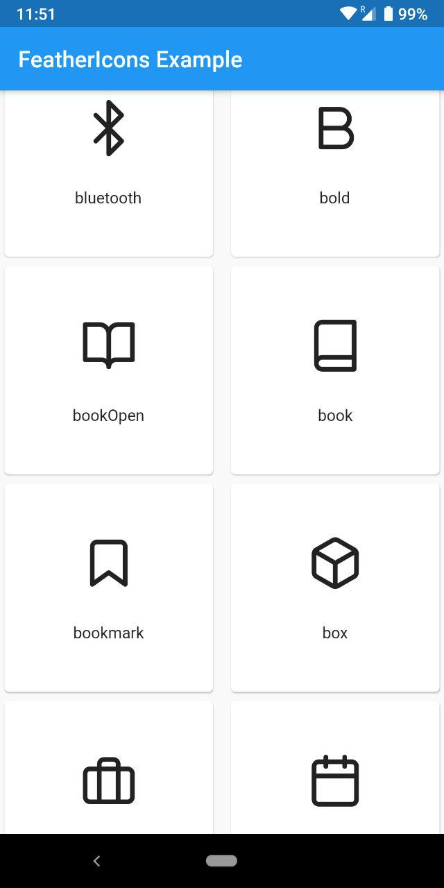
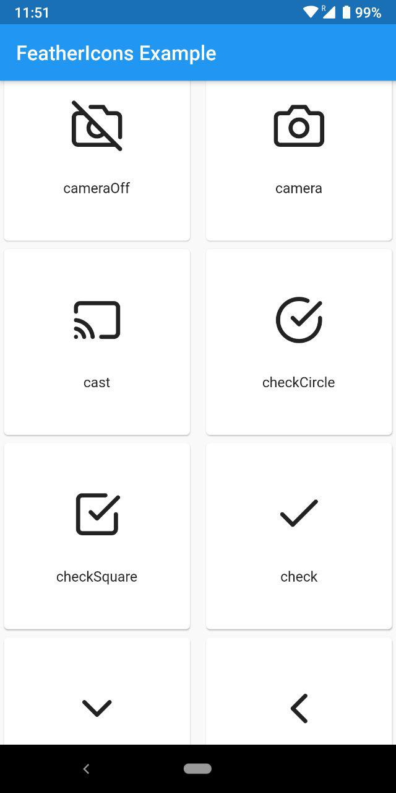

# flutter_feather_icons *v2.0.0*

## [See Catalog](https://feathericons.com/)

### **Important Note**

Naming conventions have been changed for better readability and consistancy with all other flutter icon packs

To convert from the catalog simply follow this method

```
alert-circle => alertCircle

arrow-down-left => arrowDownLeft
```

if still you face any problems have a look into the documentation (class FeatherIcons)

## **287 General Purpose Icons for Flutter**

This flutter package allows you to use all the [Feather Icons](https://github.com/feathericons/feather) made by [Feather Team](https://github.com/orgs/feathericons/people)

Find it at [pub.dartlang.org](https://pub.dev/packages/flutter_feather_icons)

## Installation

In the `dependencies:` section of your _pubspec.yaml_, add the following line:

```dart
flutter_feather_icons: ^2.0.0
```

## Usage

```dart
import "package:flutter_feather_icons/flutter_feather_icons.dart";

class MyAwesomeWidget extends StatelessWidget {
  Widget build(BuildContext context) {
    return IconButton(
      icon: Icon(FeatherIcons.github),
      onPressed: () {
          print("awesome platform to share code and ideas");
      }
    );
  }
}
```

## Example

View the flutter app in the `example` directory

## Screenshot



